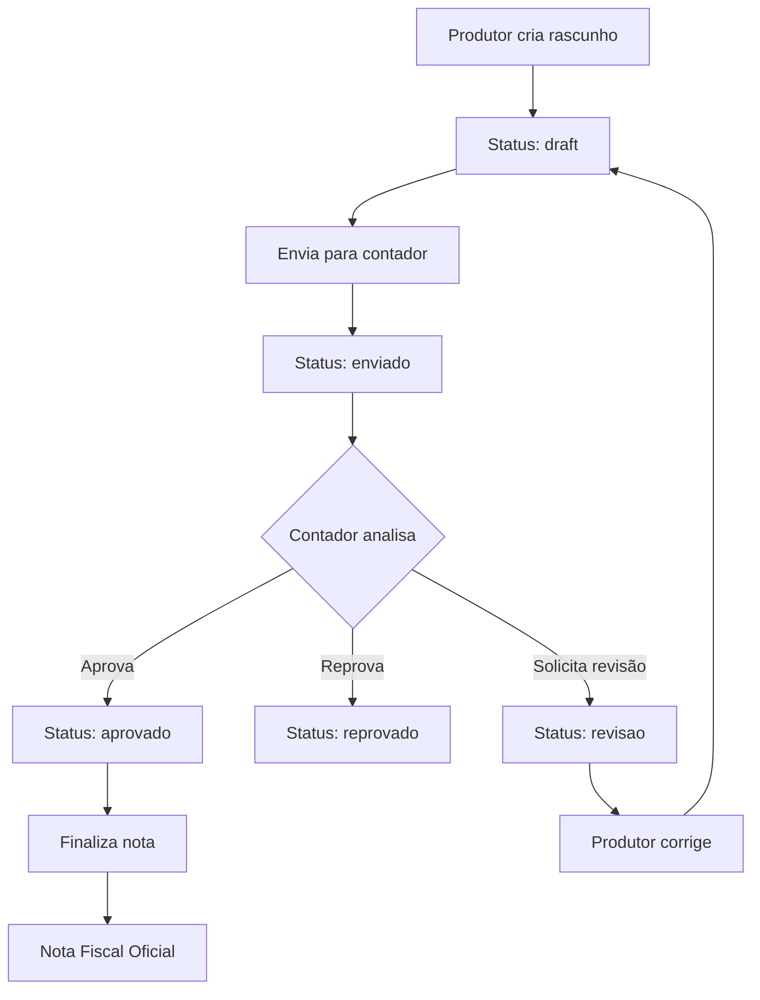

# 📝 Sistema de Geração de Nota Fiscal

## 🚀 Funcionalidades Implementadas

Este sistema permite que produtores rurais gerem notas fiscais de duas formas:

### 1. **Com Rascunho** (Recomendado para iniciantes)

- 📋 Produtor cria rascunho
- 📤 Envia para contador revisar
- ✅ Contador aprova, reprova ou solicita correções
- 🎯 Produtor finaliza após aprovação

### 2. **Geração Direta** (Para produtores experientes)

- ⚡ Gera nota fiscal diretamente
- 🏗️ Sem necessidade de aprovação
- 📋 Sistema valida automaticamente

---

## 🔄 Fluxo do Rascunho



---

## 📋 Endpoints da API

### **Rascunhos de Nota Fiscal**

#### 1. Criar Rascunho

```http
POST /api/dashboard/rascunhos
Content-Type: application/json

{
  "produtorId": "uuid-do-produtor",
  "contadorId": "uuid-do-contador", // opcional
  "tipo": "saida",
  "cfop": "5102",
  "naturezaOperacao": "Venda de produtos agrícolas",
  "nomeDestinatario": "Cooperativa Agrícola ABC Ltda",
  "cpfCnpjDestinatario": "12.345.678/0001-00",
  "ufDestino": "SP",
  "dataEmissao": "2026-02-15",
  "observacoes": "Primeira venda da safra 2026",
  "itens": [
    {
      "numeroItem": 1,
      "descricao": "Soja em Grão",
      "ncm": "12010000",
      "cfop": "5102",
      "unidade": "KG",
      "quantidade": 1000,
      "valorUnitario": 2.50,
      "valorTotal": 2500.00,
      "valorCbs": 220.00,
      "valorIbs": 442.50,
      "valorFunrural": 50.00
    }
  ]
}
```

**Resposta:**

```json
{
  "id": "rascunho-uuid",
  "produtorId": "uuid-do-produtor",
  "tipo": "saida",
  "status": "draft",
  "valorTotal": 2500.00,
  "createdAt": "2026-02-13T10:30:00Z",
  "itens": [...]
}
```

#### 2. Listar Rascunhos do Produtor

```http
GET /api/dashboard/rascunhos?produtorId=uuid-do-produtor&status=draft
```

#### 3. Obter Rascunho Específico

```http
GET /api/dashboard/rascunhos/{rascunho-id}
```

#### 4. Atualizar Rascunho

```http
PATCH /api/dashboard/rascunhos/{rascunho-id}
Content-Type: application/json

{
  "cfop": "5102",
  "observacoes": "Observações atualizadas",
  "itens": [...]
}
```

#### 5. Enviar para Contador

```http
POST /api/dashboard/rascunhos/{rascunho-id}/enviar
Content-Type: application/json

{
  "contadorId": "uuid-do-contador" // opcional se já definido
}
```

#### 6. Contador Fornece Feedback

```http
POST /api/dashboard/rascunhos/{rascunho-id}/feedback
Content-Type: application/json

{
  "status": "revisao_necessaria",
  "comentarios": "CFOP incorreto para este tipo de operação. Sugiro usar 5102.",
  "correcoesSugeridas": "Alterar CFOP para 5102 e incluir NCM correto nos itens.",
  "dadosCorrigidos": "{\"cfop\": \"5102\", \"itens\": [{\"ncm\": \"12010000\"}]}"
}
```

**Opções de status:**

- `aprovado`: Manter como está
- `reprovado`: Não pode ser finalizado
- `revisao_necessaria`: Precisa de correções

#### 7. Finalizar Nota Fiscal

```http
POST /api/dashboard/rascunhos/{rascunho-id}/finalizar
Content-Type: application/json

{
  "aplicarCorrecoes": true,
  "observacoesFinal": "Nota revisada conforme orientação do contador."
}
```

#### 8. Remover Rascunho

```http
DELETE /api/dashboard/rascunhos/{rascunho-id}
```

_Só funciona para rascunhos em status `draft`_

---

### **Geração Direta de Nota Fiscal**

#### Gerar Nota Diretamente

```http
POST /api/dashboard/notas/gerar-direta
Content-Type: application/json

{
  "produtorId": "uuid-do-produtor",
  "tipo": "saida",
  "cfop": "5102",
  "naturezaOperacao": "Venda de produtos agrícolas",
  "nomeDestinatario": "Cooperativa Agrícola ABC Ltda",
  "cpfCnpjDestinatario": "12.345.678/0001-00",
  "ufDestino": "SP",
  "dataEmissao": "2026-02-15",
  "observacoes": "Venda direta para cooperativa",
  "itens": [...]
}
```

---

### **Para Contadores**

#### Listar Rascunhos Pendentes

```http
GET /api/dashboard/contador/rascunhos-pendentes?contadorId=uuid-contador
```

---

## 📱 Como Usar no Frontend

### **Cenário 1: Produtor Iniciante (Com Rascunho)**

```typescript
// 1. Criar rascunho
const rascunho = await criarRascunho({
  produtorId: 'xxx',
  contadorId: 'yyy',
  tipo: 'saida',
  // ... outros dados
});

// 2. Enviar para contador
await enviarParaContador(rascunho.id);

// 3. Aguardar feedback do contador
// (implementar polling ou websockets)

// 4. Quando aprovado, finalizar
const notaFinal = await finalizarNota(rascunho.id, {
  aplicarCorrecoes: true,
});
```

### **Cenário 2: Produtor Experiente (Direto)**

```typescript
const notaFiscal = await gerarNotaDireta({
  produtorId: 'xxx',
  tipo: 'saida',
  cfop: '5102',
  // ... dados completos
});
```

### **Cenário 3: Interface do Contador**

```typescript
// Listar rascunhos pendentes
const pendentes = await listarRascunhosPendentes('contador-id');

// Para cada rascunho, fornecer feedback
await fornecerFeedback(rascunhoId, {
  status: 'aprovado', // ou 'revisao_necessaria' / 'reprovado'
  comentarios: 'Tudo correto!',
  // correcoesSugeridas se necessário
});
```

---

## 🎯 Estados dos Rascunhos

| Status       | Descrição               | Ações Permitidas         |
| ------------ | ----------------------- | ------------------------ |
| `draft`      | Sendo editado           | Editar, Enviar, Remover  |
| `enviado`    | Aguardando contador     | Feedback (só contador)   |
| `revisao`    | Precisa correções       | Editar, Enviar novamente |
| `aprovado`   | Aprovado pelo contador  | Finalizar                |
| `reprovado`  | Reprovado pelo contador | Editar, Enviar novamente |
| `finalizado` | Nota gerada             | Apenas consulta          |

---

## 💡 Dicas de Implementação

### **Validações Frontend**

1. **Campos obrigatórios por tipo:**
   - `entrada`: Dados do fornecedor
   - `saida`: Dados do cliente/cooperativa

2. **Validação de CFOP:**
   - 5xxx: Saídas dentro do estado
   - 6xxx: Saídas interestaduais
   - 1xxx: Entradas dentro do estado
   - 2xxx: Entradas interestaduais

3. **Cálculo automático:**
   - Valor total = Σ(valorTotal dos itens)
   - Impostos por item baseados em alíquotas

### **Notificações**

- ✉️ Email ao contador quando rascunho for enviado
- 🔔 Notificação ao produtor quando feedback chegar
- ✅ Confirmação quando nota for gerada

### **Histórico e Auditoria**

- 📊 Dashboard com rascunhos por status
- 📈 Métricas de tempo de aprovação
- 📝 Log de todas as alterações

---

## 🧪 Testes no Postman

### **Collection: Geração de Notas Fiscais**

1. **Criar Produtor** (pré-requisito)
2. **Criar Rascunho**
3. **Enviar para Contador**
4. **Fornecer Feedback**
5. **Finalizar Nota**

### **Variáveis Globais:**

- `{{baseUrl}}`: http://localhost:3001
- `{{produtorId}}`: UUID do produtor de teste
- `{{contadorId}}`: UUID do contador de teste

---

## 🚀 Próximas Funcionalidades

### **Em Desenvolvimento:**

- 📧 Sistema de notificações por email
- 📱 App mobile para contadores
- 🔄 Integração com SEFAZ (geração real)
- 📊 Dashboard analytics
- 🔍 Busca avançada de rascunhos
- 📋 Templates de notas por tipo de produto

### **Integrações Futuras:**

- 🏦 Sistema bancário (cobrança)
- 📦 Logística (rastreamento)
- 🌾 ERP agropecuário
- 💰 Sistema contábil

---

## ⚠️ Validações e Regras de Negócio

### **Rascunhos:**

- Só pode editar rascunhos em `draft` ou `revisao`
- Só pode enviar rascunhos em `draft`
- Só pode finalizar rascunhos `aprovados` ou `draft`
- Só pode remover rascunhos em `draft`

### **Notas Fiscais:**

- Chave de acesso única gerada automaticamente
- Validação de CFOP por UF
- Cálculo automático de impostos
- Numeração sequencial por série

### **Segurança:**

- Validação de produtor ativo
- Log de todas as operações
- Controle de acesso por perfil
- Validação de integridade dos dados

---

## 🎉 Resumo

O sistema de geração de nota fiscal oferece:

- ✅ **Flexibilidade**: Rascunho ou direto
- ✅ **Segurança**: Validações e controles
- ✅ **Colaboração**: Fluxo produtor-contador
- ✅ **Auditoria**: Histórico completo
- ✅ **Facilidade**: Interface intuitiva
- ✅ **Escalabilidade**: Suporte a múltiplos produtores

**Perfeito para produtores rurais que precisam gerar notas fiscais com confiança e qualidade!** 🌾📋
